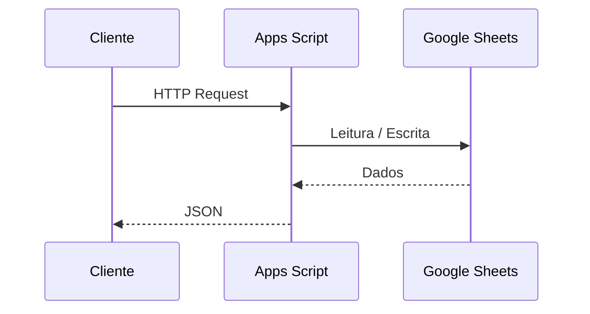

# Persistência Contextual em Arquitetura de Software

> Nem todo sistema precisa de um banco de dados transacional.
> Às vezes, persistência simples — com trade-offs explícitos — é a decisão correta.

Este repositório acompanha o artigo **“Nem todo sistema precisa de um banco de dados: uma decisão arquitetural contextual”**, cujo objetivo é discutir **quando bancos transacionais são excesso** e **quando abordagens de persistência mais simples fazem mais sentido**, sob a ótica de contexto, custo e maturidade do sistema.

---

## 🎯 Objetivo do Projeto

Este **não é um repositório de código produtivo** nem uma biblioteca reutilizável.

O objetivo é:

- Discutir **decisão arquitetural**, não ferramenta
- Explorar **trade-offs reais**, não soluções mágicas
- Questionar o uso automático de bancos transacionais em:
  - MVPs
  - Sistemas internos
  - Fluxos simples com baixa concorrência
- Demonstrar que **persistência ≠ banco de dados transacional**

---

## 🧠 Tese Central

> Arquitetura madura não é maximalista.
> Ela é **contextual, consciente e evolutiva**.

Em determinados cenários, soluções de persistência tabular acessadas por API — como **Google Sheets + Google Apps Script** — podem ser **arquiteturalmente válidas**, desde que:

- As limitações sejam conhecidas
- Os riscos sejam assumidos
- O contexto justifique a escolha

O argumento **não é de equivalência técnica**, mas de **adequação ao problema**.

---

## 📐 Conteúdo do Repositório

```text
.
├── artigo/
│   ├── artigo_arquitetura_DB.docx  # Versão editável (Word)
│   └── artigo_arquitetura_DB.pdf   # Versão para leitura
├── diagramas/
│   ├── arquitetura.mmd    # Diagramas de arquitetura
│   └── fluxo-seguranca.mmd
└── README.md              # Este arquivo
```

### 🏗️ Arquitetura Discutida (Alto Nível)



O foco não é “substituir backends tradicionais”, mas reduzir fricção quando a complexidade da infraestrutura é maior que o problema resolvido.

### ⚠️ Limitações Assumidas

Esta abordagem não é ACID e não escala indefinidamente.

Limitações reais incluem:

- Race conditions
- Inconsistência temporal
- Ausência de transações
- Dependência do ecossistema Google (lock-in)

Essas limitações não são ignoradas — elas fazem parte da decisão.

### 🧩 Quando Faz Sentido

**✔ Faz sentido quando:**

- Poucos usuários simultâneos
- Baixa taxa de escrita
- Dados de baixa criticidade
- Necessidade de inspeção humana
- Foco em velocidade e baixo custo operacional

**✖ Evite quando:**

- Há concorrência elevada
- Os dados são críticos ou sensíveis
- São necessárias transações complexas
- Existe exigência de SLA rigoroso

### 🔁 Alternativas no Mesmo Espaço Arquitetural

Este repositório não defende Sheets como solução universal.

Outras opções de baixa fricção incluem:

- Airtable
- Firebase
- Supabase (setup mínimo)
- Notion (com ressalvas)

O ponto central permanece: escolha por contexto, não por dogma.

### 📄 Artigo Completo

👉 [Leia o artigo completo aqui](https://me-documentacao.github.io/persistencia-contextual-db/)

### 📌 Observação Final

Este projeto é um convite à reflexão arquitetural.

Antes de perguntar:

“Qual banco de dados usar?”

Talvez a pergunta correta seja:

“Qual nível de persistência esse problema realmente exige agora?”
